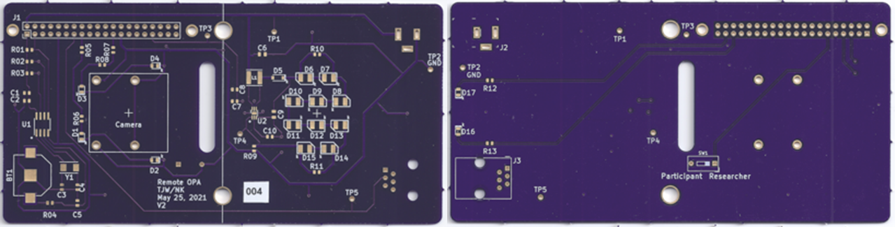
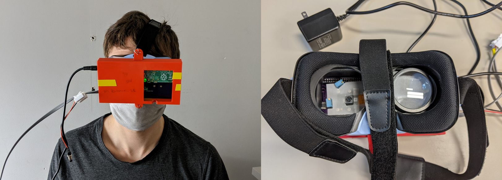
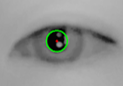
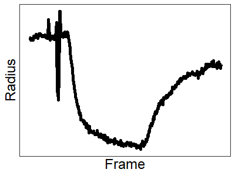

# Remote OPA
## Goal
The goal of this project is to build a mobile version of the [Ocular Photosensitivity Analyzer (OPA)](https://www.ncbi.nlm.nih.gov/pmc/articles/PMC6238927/) that we can use to record light sensitivity outside the lab setting, like at peoples homes or in a hospital bed.

## Approach
Through a couple of iterations I have built a Raspberry Pi-driven device with several components:
- White light LEDs to deliver a light pulse in one eye
- LED driver to dim the LEDs
- IR camera with IR LED to record the pupil response in the other eye
- A clock to provide a timestamp with each data point
- A physical button for the user to interact with the device
- A Raspberry Pi to connect all the components, control the lights, and record the data
- Custom-designed Printed Circuit Board to keep all components together inside VR goggles  

## Parts
<!-- <details>
  <summary>Click here to see a description of all the parts.</summary> -->

#### 1. Housing
We designed our own PCB and 3D-printed case. Both were designed to work with the empty case of VR goggles.
-   
-   
- [VR Goggles](https://www.amazon.com/dp/B01M3RN5X7/?coliid=I1A8O2H72PV38Y&colid=2SN8Q5C0S8ZID&psc=0&ref_=lv_ov_lig_dp_it)


#### 2. The light source
We choose to use 10 white light LEDs and use a LED driver for pulse with modulation dimming.
- [White LEDs](https://eu.mouser.com/ProductDetail/Osram-Opto-Semiconductor/LW-TWTGBB-BXCX-2B12C3-Z486?qs=sGAEpiMZZMv0NwlthflBi3P09y5JMSjSKTpEPPMo8d0=)
- [LED driver](https://eu.mouser.com/ProductDetail/Texas-Instruments/TPS61161ADRVR?qs=fvVej%2FMj3jdhGttLWUDBiA==)

#### 3. The Camera
We used an NoIR camera (i.e. no IR *filter*, therefore it can see IR) with a long wavelength LED to record pupil responses
- [Raspberry Pi NoIR Camera Board v2 - 8 Megapixels](https://www.adafruit.com/product/3100)
- [IR LEDs](https://eu.mouser.com/ProductDetail/Kingbright/APT2012SF4C-PRV?qs=f499HRGa1RnfiWuPE%2FmgSQ==)

#### 4. The raspberry pi
A raspberry pi controls the light source, the camera, button presses and stores all the data.
- [Raspberry Pi Zero W](https://www.adafruit.com/product/3708)


<!-- </details> -->

## Results
I successfully built a prototype that tracks pupil size throughout a few minutes of recording. Below is an example of a pupil constriction in response to a light pulse, as well as the pupil detection by the openCV-based algorithm  
  
  

Tracking the size over time will look something like this:  
   

## Detailed instructions on how to build this yourself, including all the open-source files, will be released upon publication of the validation study.
<!--
## Assembling the parts


## Setting up the RPiW
I am using a Rpi ZeroW. Getting it up and running

If you're not familiar with Raspberry pi, there are many tutorials online on how to get started, I recommend starting with [this](https://www.instructables.com/Connect-to-a-Raspberry-Pi-Zero-W-Via-USB-No-Mini-H/O) or [this](https://desertbot.io/blog/headless-pi-zero-ssh-access-over-usb-windows) tutorial. Briefly, here are the steps.  
https://www.raspberrypi.org/forums/viewtopic.php?t=267267

1. Download latest version of Raspberry Pi OS (formarly raspbian) lite (I used 2020-05-27-raspios-buster-lite) and flash on SD card (I use balenaEtcher)
2. Prepare the card to use SSH (you'll need to edit and create some files)
3. Install Bounjour
4. Insert SD in RPi and boot.
4. You may have to install RNDIS drivers (see [this solution](https://www.raspberrypi.org/forums/viewtopic.php?t=245184)])
5. Enable network sharing
6. Always start by running `sudo apt-get update` and `sudo apt-get upgrade` (this may take some time)

## Set up GPIO for PWM
`sudo apt install python3-pigpio`

`sudo pigpiod` # need to run before running python #https://gpiozero.readthedocs.io/en/stable/remote_gpio.html#preparing-the-raspberry-pi

To automate running the daemon at boot time, run:
$ `sudo systemctl enable pigpiod`
To run the daemon once using systemctl, run:
$ `sudo systemctl start pigpiod`

http://abyz.me.uk/rpi/pigpio/python.html#hardware_PWM


#set upt the Pi for camera
`sudo apt-get install -y python3-picamera`

#### enable the camera
`sudo raspi-config`
5 interfacing options -> P1 Camera ->  <Yes>
7 advanced options -> A3 Memory split -> 256

`sudo apt-get install ffmpeg`

# Set up the clock
#### enable i2c
`sudo raspi-config`
enable i2c and change tz if desired

#### edit config.txt
`sudo nano /boot/config.txt`
add to end of file:
# Enable i2c real-time clock
dtoverlay=i2c-rtc,mcp7940x

#### instal i2c tools
`sudo apt-get install -y python3-smbus`
`sudo apt-get install -y i2c-tools`

reboot the pi using
`sudo reboot now`

#### check if the clock is connected using
`sudo i2cdetect -y 1`

#### to sync the RTC to internet Time run
`date`
`timedatectl`
`sudo hwclock -w`
`sudo hwclock -r`


#run at reboot
https://www.raspberrypi-spy.co.uk/2013/07/running-a-python-script-at-boot-using-cron/


``` python3
import pigpio
import time

pi = pigpio.pi()
time.sleep(1)

def pwm(x):
 pi.hardware_PWM(12, 60, x * 10000)

try:
  while True:
    for p in range (0, 100, 5):
      pwm(p)
      time.sleep(0.1)

    for p in range (100, 0, -5):
      pwm(p)
      time.sleep(0.1)

except KeyboardInterrupt:
  pwm(0)
  pi.stop()
```

import pigpio
import time

pi = pigpio.pi()
time.sleep(1)

def pwm(x):
 pi.hardware_PWM(12, 60, x * 10000)

p = 1
while p < 100:
  pwm(p)
  time.sleep(2)
  pwm(0)
  time.sleep(1)
  p = p * 2
pwm(100)
time.sleep(2)
pwm(0)
pi.stop()


##install git
https://linuxize.com/post/how-to-install-git-on-raspberry-pi/

## install h264
http://jollejolles.com/installing-ffmpeg-with-h264-support-on-raspberry-pi/

##Save outputs
https://picamera.readthedocs.io/en/release-1.13/recipes2.html#custom-outputs
https://www.raspberrypi.org/forums/viewtopic.php?t=267096

https://wiki.debian.org/ffmpeg#Installation


# Set up GPIO for PWM
#https://www.radishlogic.com/raspberry-pi/raspberry-pi-pwm-gpio/

run `sudo apt-get install python3-rpi.gpio` on command line
set up a python script with:
`nano pwm_test.py`

``` python
import RPi.GPIO as GPIO
import time
GPIO.setmode(GPIO.BOARD)
GPIO.setup(32, GPIO.OUT)
pwm32 = GPIO.PWM(32, 60)
pwm32.start(0)

try:
  while True:
    for dutyCycle in range (0, 100, 5):
      pwm32.ChangeDutyCycle(dutyCycle)
      time.sleep(0.1)

    for dutyCycle in range (100, 0, -5):
      pwm32.ChangeDutyCycle(dutyCycle)
      time.sleep(0.1)

except KeyboardInterrupt:
  pwm32.stop()

# Cleans the GPIO
GPIO.cleanup()
```

Save and close

`python3 pwm_test.py`

Need to switch to RPIO.GPIO to avoid software flicker
https://www.raspberrypi.org/forums/viewtopic.php?t=80223


https://pythonhosted.org/RPIO/pwm_py.html#examples

#install
`sudo apt-get install python-setuptools`
`sudo easy_install -U RPIO`

sudo apt-get install pip3

sudo apt-get install python3-pip
sudo pip3 install RPIO

``` python
from RPIO import PWM

# Setup PWM and DMA channel 0
PWM.setup()
PWM.init_channel(0)
PWM.add_channel_pulse(0, 17, 0, 100) #Granulaity is 10us #Subcycle is 20ms #100 is 100 * 10 = 1000us = 1ms
PWM.add_channel_pulse(0, 17, 0, 200)
PWM.clear_channel_gpio(0, 17)
PWM.cleanup()

```


https://www.raspberrypi.org/forums/viewtopic.php?p=1046060#p1046060


$ sudo apt install git
$ git clone https://github.com/metachris/RPIO.git #https://github.com/metachris/RPIO/tree/v2.zip #
$ cd RPIO
$ sudo python3 setup.py install

git clone https://github.com/JamesGKent/RPIO RPIO2

https://github.com/JamesGKent/RPIO/tree/v2

https://github.com/JamesGKent/RPIO/archive/v2.zip


wget https://github.com/metachris/RPIO/archive/v2.zip
sudo apt-get install python3-dev
unzip v2.zip
cd RPIO-2/
sudo python3 setup.py install


# PCB desing
Designed with [KiCad](https://kicad.org/download/)
following [this](https://www.youtube.com/watch?v=vaCVh2SAZY4&ab_channel=Digi-Key) tutorial series -->
